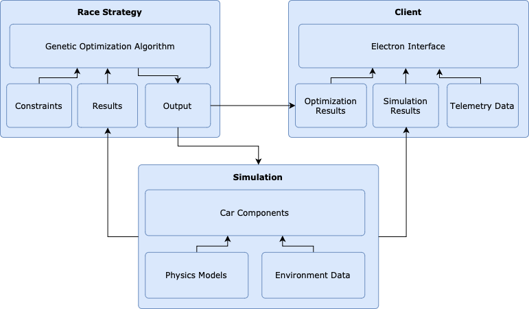
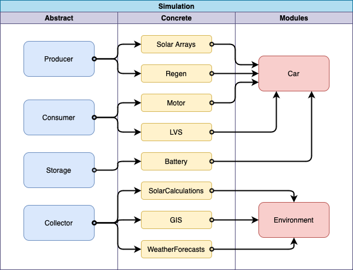
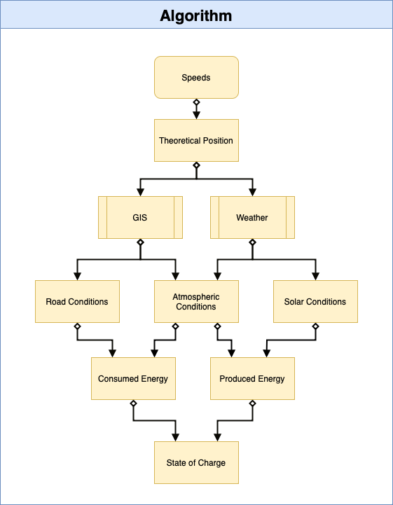

# Simulation

This repository composes two aspects of UBC Solar's race strategy: the simulation and race strategy algorithm. 

Table of Contents
- [Arrays](../simulation/arrays/module-info.md)
- [Battery](../simulation/battery/module-info.md)
- [Cache](../simulation/cache/module-info.md)
- [Common](../simulation/common/module-info.md)
- [Config](../simulation/config/module-info.md)
- [Data](../simulation/data/module-info.md)
- [Environment](../simulation/environment/module-info.md)
- [Library](../simulation/library/module-info.md)
- [LVS](../simulation/lvs/module-info.md)
- [Main](../simulation/main/module-info.md)
- [Motor](../simulation/motor/module-info.md)
- [Optimization](../simulation/optimization/module-info.md)
- [Regen](../simulation/regen/module-info.md)
- [Utils](../simulation/utils/module-info.md)

